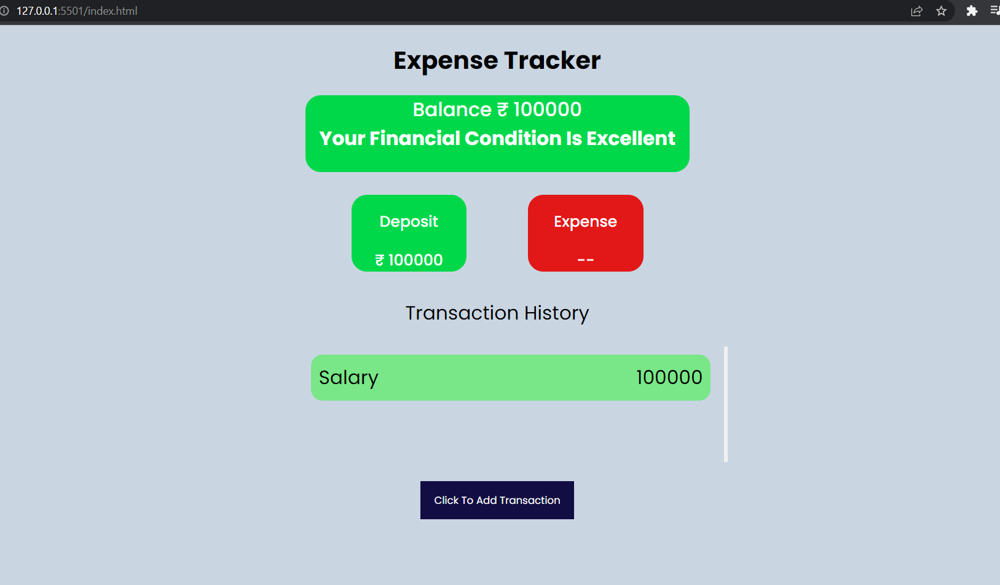

# Expense Tracker Using Javascript

This is application can be used as an expense tracker to track all your daily expenses, it is built using HTML, CSS, Javscript. here when you click on add expense button you get an form using that you can add ur expense into the list. If it is an credit it would appear in green in list if it is an debit it will appear in red, you can all check balance and your financial health green represents health is good, yellow represents moderate, red represents danger.

Screenshot 1

Screenshot 2

